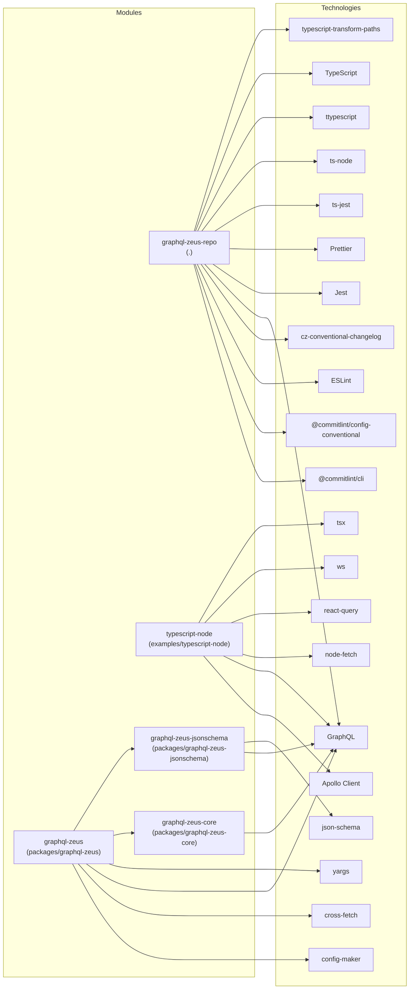

# Repository Technology Graph

High-level technologies per package/repository.

## Mermaid Graph

## graphql-zeus-repo (.)
- @commitlint/cli: @commitlint/cli
- @commitlint/config-conventional: @commitlint/config-conventional
- cz-conventional-changelog: cz-conventional-changelog
- ESLint: @typescript-eslint/eslint-plugin, @typescript-eslint/parser, eslint, eslint-config-prettier, eslint-plugin-prettier
- GraphQL: graphql-ws
- Jest: jest
- Prettier: prettier
- ts-jest: ts-jest
- ts-node: ts-node
- ttypescript: ttypescript
- TypeScript: typescript
- typescript-transform-paths: typescript-transform-paths

## typescript-node (examples/typescript-node)
- Apollo Client: @apollo/client
- GraphQL: @graphql-typed-document-node/core, graphql-tag
- node-fetch: node-fetch
- react-query: react-query
- tsx: tsx
- ws: ws

## graphql-zeus (packages/graphql-zeus)
- config-maker: config-maker
- cross-fetch: cross-fetch
- GraphQL: graphql-zeus-core, graphql-zeus-jsonschema
- yargs: yargs

## graphql-zeus-core (packages/graphql-zeus-core)
- GraphQL: graphql, graphql-js-tree, graphql-ws

## graphql-zeus-jsonschema (packages/graphql-zeus-jsonschema)
- GraphQL: graphql, graphql-js-tree, graphql-ws
- json-schema: json-schema
