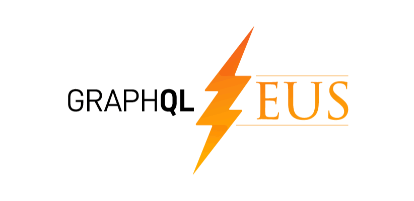
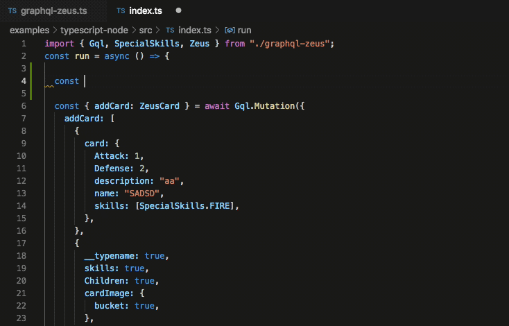

[](https://www.npmjs.com/package/graphql-zeus) [](http://commitizen.github.io/cz-cli/) [](https://www.npmjs.com/package/graphql-zeus)

GraphQL Zeus creates autocomplete client library for `JavaScript` or `TypeScript` which provides autocompletion for strongly typed queries.

⚡⚡ From version 2.0 Zeus support mapped types

⚡⚡⚡ From version 3.0 Zeus supports

- JSON schema generation
- Subscriptions
- ZeusHook Type for extracting the response type

Supported Languages:

- Javascript
  - Browser
  - NodeJS
  - React Native
- TypeScript
  - Browser
  - NodeJS
  - React Native

## How it works

Given the following schema [Olympus Cards](https://app.graphqleditor.com/a-team/olympus)



## Table of contents

- [How it works](#how-it-works)
- [Table of contents](#table-of-contents)
- [License](#license)
- [How to use](#how-to-use)
  - [As a CLI](#as-a-cli)
    - [Installation](#installation)
    - [Usage with JavaScript](#usage-with-javascript)
    - [Usage with TypeScript](#usage-with-typescript)
      - [Return with .js import for esModules](#return-with-js-import-for-esmodules)
    - [Usage with Apollo GraphQL](#usage-with-apollo-graphql)
      - [Inferring the response type](#inferring-the-response-type)
    - [Usage with NodeJS](#usage-with-nodejs)
    - [Usage with React Native](#usage-with-react-native)
    - [Load from URL](#load-from-url)
  - [Use generated client example](#use-generated-client-example)
    - [Perform query with Chain](#perform-query-with-chain)
    - [Listen on a websocket - GraphQL Subscription](#listen-on-a-websocket---graphql-subscription)
    - [Perform query with Thunder - Abstracted Fetch function](#perform-query-with-thunder---abstracted-fetch-function)
    - [Unions](#unions)
    - [Interfaces](#interfaces)
    - [Perform query with aliases](#perform-query-with-aliases)
    - [Variables](#variables)
    - [Gql string](#gql-string)
    - [JavaScript Type Casting](#javascript-type-casting)
    - [Typescript SelectionSet](#typescript-selectionset)
  - [ZeusHook](#zeushook)
  - [Spec](#spec)
    - [Use Alias Spec](#use-alias-spec)
  - [Use In your Project to generate code](#use-in-your-project-to-generate-code)
  - [Use in your project to dynamically fetch schema](#use-in-your-project-to-dynamically-fetch-schema)
- [Support](#support)
- [Contribute](#contribute)
- [Parsing](#parsing)

## License

MIT

## How to use

Main usage of graphql zeus should be as a CLI.

### As a CLI

#### Installation

Install globally

```sh
$ npm i -g graphql-zeus
```

Of course you can install locally to a project and then use as a npm command or with `npx`

#### Usage with JavaScript

```sh
$ zeus schema.graphql ./
```

It will also generate corresponding out.d.ts file so you can have autocompletion,

#### Usage with TypeScript

```sh
$ zeus schema.graphql ./  --ts
```

##### Return with .js import for esModules

Due to validity of `.js` imports in TS for esmodules you can use flag `es` to generate `.js` imports

```sh
$ zeus schema.graphql ./  --ts --es
```

#### Usage with Apollo GraphQL

It will generate `useTypedQuery` `useTypedMutation` etc... based on Apollo useQuery thanks @GavinRay97. All types in data are inherited from zeus query

```sh
$ zeus schema.graphql ./  --apollo
```

```tsx
import { useTypedQuery } from './zeus/apollo';

const Main = () => {
  const { data } = useTypedQuery({
    drawCard: {
      name: true,
    },
  });
  return <div>{data.drawCard.name}</div>;
};
```

##### Inferring the response type

Sometimes you would like to infer the response type. The it is best to use selectors

```tsx
import { Selectors, InputType, GraphQLTypes } from './zeus';

export const drawCardQuery = Selectors.query({
  drawCard: {
    Attack: true,
    Children: true,
    id: true,
  },
});

type InferredResponseType = InputType<GraphQLTypes['Query'], typeof drawCardQuery>;
```

You can also use it in useTypedQuery later

```tsx
import { useTypedQuery } from './zeus/apollo';
import { drawCardQuery } from './';

const Main = () => {
  const { data } = useTypedQuery(drawCardQuery);
  return <div>{data.drawCard.name}</div>;
};
```

#### Usage with NodeJS

```sh
$ zeus schema.graphql ./  --node
```

#### Usage with React Native

Same as browser

```sh
$ zeus schema.graphql ./
```

#### Load from URL

```sh
$ zeus https://faker.graphqleditor.com/a-team/olympus/graphql ./generated
```

With Authorization header

```sh
$ zeus https://faker.graphqleditor.com/a-team/olympus/graphql ./generated --header=Authorization:dsadasdASsad
```

### Use generated client example

```sh
$ zeus https://faker.graphqleditor.com/a-team/olympus/graphql ./generated
```

#### Perform query with Chain

```js
import { Chain } from './zeus';
const createCards = async () => {
  const chain = Chain('https://faker.graphqleditor.com/a-team/olympus/graphql');
  const listCardsAndDraw = await chain.query({
    cardById: [
      {
        cardId: 'sdsd'
      },
      {
        description: true
      }
    ],
    listCards: {
      name: true,
      skills: true,
      attack: [
        { cardID: ['s', 'sd'] },
        {
          name: true
        }
      ]
    },
    drawCard: {
      name: true,
      skills: true,
      Attack: true
    }
  });
};
createCards();
// Result of a query
// {
//     "drawCard": {
//         "Attack": 83920,
//         "name": "Raphaelle",
//         "skills": [
//             "RAIN",
//             "
",
//         ]
//     },
//     "cardById": {
//         "description": "Customer"
//     },
//     "listCards": [
//         {
//             "name": "Lon",
//             "skills": [
//                 "THUNDER"
//             ],
//             "attack": [
//                 {
//                     "name": "Christop"
//                 },
//                 {
//                     "name": "Theodore"
//                 },
//                 {
//                     "name": "Marcelle"
//                 }
//             ]
//         },
//         {
//             "name": "Etha",
//             "skills": null,
//             "attack": [

//                 {
//                     "name": "Naomie"
//                 }
//             ]
//         },
//         {
//             "attack": [
//                 {
//                     "name": "Kyle"
//                 },
//             ],
//             "name": "Arlene",
//             "skills": [
//                 "FIRE",
//             ]
//         }
//     ]
// }
```

#### Listen on a websocket - GraphQL Subscription

This creates websocket connection between your backend GraphQL socket and web browser one.

```ts
const chain = Chain('https://faker.graphqleditor.com/a-team/olympus/graphql');
chain
  .subscription({
    cardPile: {
      id: true,
    },
  })
  .on((response) => {
    console.log(response.cardPile);
  });
```

#### Perform query with Thunder - Abstracted Fetch function

With thunder you have total control of fetch function not losing the result format the same time.

```js
import { Thunder } from './zeus';
const createCards = async () => {
  const thunder = Thunder(async (query) => {
    const response = await fetch('https://faker.graphqleditor.com/a-team/olympus/graphql', {
      body: JSON.stringify({ query }),
      method: 'POST',
      headers: {
        'Content-Type': 'application/json',
      },
    });
    if (!response.ok) {
      return new Promise((resolve, reject) => {
        response
          .text()
          .then((text) => {
            try {
              reject(JSON.parse(text));
            } catch (err) {
              reject(text);
            }
          })
          .catch(reject);
      });
    }
    const json = await response.json();
    return json.data;
  });
  const listCardsAndDraw = await thunder.query({
    cardById: [
      {
        cardId: 'sdsd',
      },
      {
        description: true,
      },
    ],
    listCards: {
      name: true,
      skills: true,
      attack: [
        { cardID: ['s', 'sd'] },
        {
          name: true,
        },
      ],
    },
    drawCard: {
      name: true,
      skills: true,
      Attack: true,
    },
  });
};
createCards();
// Result of a query
// {
//     "drawCard": {
//         "Attack": 83920,
//         "name": "Raphaelle",
//         "skills": [
//             "RAIN",
//             "THUNDER",
//         ]
//     },
//     "cardById": {
//         "description": "Customer"
//     },
//     "listCards": [
//         {
//             "name": "Lon",
//             "skills": [
//                 "THUNDER"
//             ],
//             "attack": [
//                 {
//                     "name": "Christop"
//                 },
//                 {
//                     "name": "Theodore"
//                 },
//                 {
//                     "name": "Marcelle"
//                 }
//             ]
//         },
//         {
//             "name": "Etha",
//             "skills": null,
//             "attack": [

//                 {
//                     "name": "Naomie"
//                 }
//             ]
//         },
//         {
//             "attack": [
//                 {
//                     "name": "Kyle"
//                 },
//             ],
//             "name": "Arlene",
//             "skills": [
//                 "FIRE",
//             ]
//         }
//     ]
// }
```

#### Unions

You can use Zeus with unions:

```js
const { drawChangeCard } = await chain.query({
  drawChangeCard: {
    __typename: true,
    '...on EffectCard': {
      effectSize: true,
      name: true,
    },
    '...on SpecialCard': {
      effect: true,
      name: true,
    },
  },
});
// drawChangeCard result:
// {
//     "effectSize": 195.99532210956377,
//     "name": "Destinee",
//     "__typename": "EffectCard"
// }
```

#### Interfaces

And interfaces.

```ts
const { nameables } = await Gql.query({
  nameables: {
    __typename: true,
    name: true,
    '...on CardStack': {
      cards: {
        Defense: true,
      },
    },
    '...on Card': {
      Attack: true,
    },
  },
});
// result
// {
//     "nameables": [
//         {
//             "__typename": "EffectCard",
//             "name": "Hector"
//         },
//         {
//             "__typename": "CardStack",
//             "name": "Scotty",
//             "cards": [
//                 {
//                     "Defense": 1950
//                 },
//                 {
//                     "Defense": 76566
//                 },
//                 {
//                     "Defense": 64261
//                 }
//             ]
//         },
//         {
//             "__typename": "SpecialCard",
//             "name": "Itzel"
//         },
//     ]
// }
```

#### Perform query with aliases

```js
const aliasedQueryExecute = await chain.query({
  listCards: {
    __alias: {
      atak: {
        attack: [
          { cardID: ['1'] },
          {
            name: true,
            description: true,
          },
        ],
      },
    },
  },
});
// RESULT
// {
//     "listCards": [
//         {
//             "atak": {
//                 "attack": [
//                     {
//                         "name": "Zelma",
//                         "description": "Central"
//                     }
//                 ]
//             }
//         }
//     ]
// }
```

So you can access properties type-safe like this

```js
aliasedQueryExecute.listCards.map((c) => c.atak.attack);
```

#### Variables

To perform query with variables please import `$` function and pass the variables to query

```ts
const test = await Gql.mutation(
  {
    addCard: [
      {
        card: $`card`,
      },
      {
        id: true,
        description: true,
        name: true,
        Attack: true,
        skills: true,
        Children: true,
        Defense: true,
        cardImage: {
          bucket: true,
          region: true,
          key: true,
        },
      },
    ],
  },
  {
    card: {
      Attack: 2,
      Defense: 3,
      description: 'Lord of the mountains',
      name: 'Golrog',
    },
  },
);
```

#### Gql string

Use Zeus to generate gql string

```js
import { Zeus } from './zeus';
const createCards = async () => {
  const stringGql = Zeus.query({
    listCards: {
      name: true,
      skills: true,
      Attack: true,
    },
  });
  // query{listCards{name skills Attack}}
};
createCards();
```

To run the example navigate to: `./examples` and run

```sh
$ npm i
```

then run

```
$ npm run start
```

Use `Api` for single queries mutations and `Chain` for query chaining

#### JavaScript Type Casting

You can cast your response from fetch/apollo/other-lib to correct type even if you are using JavaScript:

```js
import { Cast } from './zeus';
const myQuery = Cast.query(myLib('somegraphqlendpoint'));
```

#### Typescript SelectionSet

In TypeScript you can make type-safe selection sets to reuse them across queries
You can use Selectors on operations or ZeusSelect on concrete type. Only `Selectors` make sense in JS as usage of `ZeusSelect` on type is impossible without type support :)

```ts
import { ZeusSelect, Selectors, Chain, ValueTypes } from './zeus';
const chain = Chain('https://faker.graphqleditor.com/a-team/olympus/graphql');

const { drawCard: cardSelector } = Selectors.query({
  drawCard: {
    name: true,
    description: true,
    Attack: true,
    skills: true,
    Defense: true,
    cardImage: {
      key: true,
      bucket: true,
    },
  },
});

const queryWithSelectionSet = await chain.query({
  drawCard: cardSelector,
});
```

### ZeusHook

Assuming that you created hook like function

```ts
import { Gql, ZeusHook } from './zeus';

export const useZeus = () => {
  const drawACard = () => {
    return Gql.query({
      drawCard: {
        name: true,
        Attack: true,
        Defense: true,
        Children: true,
        description: true,
      },
    });
  };
  return { drawACard };
};

type DrawCardResponse = ZeusHook<typeof useZeus, 'drawACard'>;
```

Zeus generates an easy to use Type so you can decalare your zeus queries inside function

### Spec

Promise of type query data object is returned.

```
PROMISE_RETURNING_OBJECT = Chain.[OPERATION_NAME]({
    ...FUNCTION_FIELD_PARAMS
})(
    ...QUERY_OBJECT
).then ( RESPONSE_OBJECT => RESPONSE_OBJECT[OPERATION_FIELD] )
```

Simple function params object

```
FUNCTION_FIELD_PARAMS = {
  KEY: VALUE
}
```

Query object

```
QUERY_OBJECT = {
    ...RETURN_PARAMS
}
```

Return params is an object containg RETURN_KEY - true if it is a `scalar`, RETURN_PARAMS if `type` otherwise it is a function where you pass Fiel params and type return params.

```
RETURN_PARAMS = {
    RETURN_KEY: true,
    RETURN_KEY: {
        ...RETURN_PARAMS
    },
    RETURN_FUNCTION_KEY:[
        {
            ...FUNCTION_FIELD_PARAMS
        },
        {
            ...RETURN_PARAMS
        }
    ]
}
```

#### Use Alias Spec

```
RETURN_PARAMS = {
  __alias: RETURN_PARAMS
}
```

Access aliased operation type-safe

```
PROMISE_RETURNING_OBJECT[ALIAS_STRING][OPERATION_NAME]
```

### Use In your Project to generate code

This will be rarely used, but here you are!

```js
import { TreeToTS } from 'graphql-zeus';
import { Parser } from 'graphql-js-tree';

const schemaFileContents = `
type Query{
    hello: String!
}
schema{
    query: Query
}
`;

const typeScriptDefinition = TreeToTS.resolveTree(Parser.parse(schemaFileContents));

const jsDefinition = TreeToTS.javascript(Parser.parse(schemaFileContents));
```

### Use in your project to dynamically fetch schema

This is useful when you need some schema fetched from your GraphQL endpoint

```js
import { Utils } from 'graphql-zeus';

Utils.getFromUrl('https://faker.graphqleditor.com/a-team/olympus/graphql').then((schemaContent) => {
  // Use schema content here
});
```

## Support

[Join our GraphQL Editor Channel](https://join.slack.com/t/graphqleditor/shared_invite/enQtNDkwOTgyOTM5OTc1LWI4YjU3N2U5NGVkNzQ2NzY5MGUxMTJiNjFlZDM1Zjc2OWRmNTI0NDM3OWUxYTk4Yjk3MzZlY2QwOWUzZmM2NDI)

Leave a star ;)

## Contribute

For a complete guide to contributing to GraphQL Editor, see the [Contribution Guide](CONTRIBUTING.md).

1.  Fork this repo
2.  Create your feature branch: git checkout -b feature-name
3.  Commit your changes: git commit -am 'Add some feature'
4.  Push to the branch: git push origin my-new-feature
5.  Submit a pull request

## Parsing

Simplier approach to GraphQL parsing. Using graphql-js library and parsing AST to simplier types.
